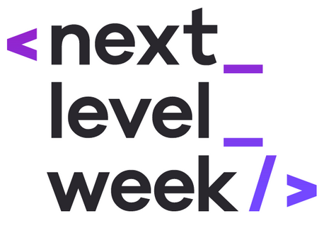

<p align="center">
  
</p>
<h3 align="center"> Ecoleta - Seu marketplace de coleta de resíduos..js </h3>
<p>
<p>

## :pushpin: DEMO:
Acesse [aqui](https://nlw-2020-web.herokuapp.com/) para testar essa aplicação online.

## Sobre:
Back-end da aplicação ecoleta desenvolvida durante a Next Level Week da [RocketSeat](https://rocketseat.com.br/).  
Neste projeto criamos uma aplicação onde é possível realizar cadastros de pontos de coleta de resíduos e buscarmos esses pontos filtrando por tipo de coleta e localidade.  
  
Veja aqui o [Front-end](https://github.com/muriloportugal/nlw-2020-web) desta aplicação e aqui o desenvolvimento [Mobile](https://github.com/muriloportugal/nlw-2020-mobile).  


  
## :checkered_flag: Como utilizar:
Você irá precisar ter o banco de dados [Postgres](https://www.postgresql.org/) instalado ou executando o mesmo através do [Docker](https://hub.docker.com/_/postgres) e criar um banco chamado "ecoleta".  

Faça o download ou o clone deste repositório para o seu computador. Entre na pasta "server" e rode o comando abaixo para que sejam instaladas as dependências:
```bash
npm install
```  

Edite o arquivo [knexfile.ts](./knexfile.ts) e altere o parâmetro "connection" com a url de conexão com o seu banco de dados.  
Renomeie o arquivo [.env.Exemple](./.env.Exemple) para .env e edite seu conteúdo com as informações corretas do seu ambiente.  
Agora rode os comandos abaixo para que sejam criadas as tabelas e seus conteúdos.
 ```bash
npm run knex:migrate
npm run knex:seed
```  

Depois de instalar as dependências e criar o banco de dados, pode executar o comando abaixo para iniciar o serviço e utilizar o [insomnia](https://insomnia.rest/) para envio das requests.
```bash
npm run dev
```
___
## :robot: Tecnologias:
- NodeJS
- Postgres
- Docker
- Google Geocoding API

---
## :memo: Licença

Esse projeto está sob a licença MIT. Veja o arquivo [LICENSE](./LICENSE) para mais detalhes.
